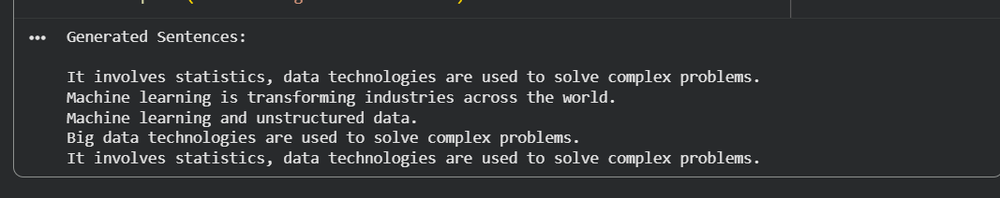

# PRODIGY_GAI_03
A Python-based implementation of text generation using Markov Chains, leveraging probabilistic models to generate coherent and natural language sentences from a given dataset
# 🧠 Task-03: Text Generation with Markov Chains

## 📌 Project Overview

This project demonstrates **text generation using Markov Chains**, a probabilistic model that predicts the next word based on previous words.
The model is trained on a sample dataset and generates new sentences that resemble the input text.

---

## 🚀 Features

* Generates human-like text automatically
* Uses probabilistic word prediction
* Adjustable context using `state_size`
* Simple implementation using Python

---

## 🧠 Concept

A **Markov Chain** works on the principle that:

> The next word depends only on the previous word(s), not the entire sentence.

The model learns word transitions from the dataset and uses them to generate new text.

---

## ⚙️ Technologies Used

* Python
* Markovify
* Google Colab

---

## ▶️ How to Run

1. Open the notebook in Google Colab
2. Run all cells
3. The model will generate sentences automatically

---

## 💻 Code Snippet

```python id="u1qk8o"
import markovify

text = """Your dataset text here"""

model = markovify.Text(text, state_size=2)

for i in range(5):
    print(model.make_short_sentence(120))
```

---

## 📊 Sample Output

```id="l2y6pe"
Generated Sentences:

Data science helps organizations make better decisions.
Machine learning is a subset of artificial intelligence.
Big data technologies are used to process large volumes of data.
```

---

## 📸 Output Screenshot



---

## 📚 References

* Markov Chains Text Generation Article
* Predictive Text Generation Notebook

---

## 👩‍💻 Author

**Rithika Singh Patel**

---

## ⭐ Acknowledgment

This project is part of a **Generative AI Internship Task** focused on understanding text generation using probabilistic models.
